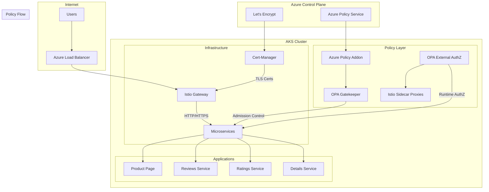
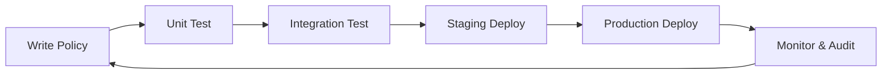

# AKS with Istio, OPA, and Comprehensive Policy Enforcement

This repository demonstrates how to build a production-ready Kubernetes platform on Azure with **end-to-end policy enforcement**. You'll learn how to implement both **infrastructure governance** and **application-level authorization** using industry-standard tools and practices.

## 🎯 What This Demo Teaches

This is **not just another Kubernetes deployment**. This demo showcases a complete **policy-as-code** platform that addresses real-world enterprise requirements:

### **🏗️ Infrastructure Governance (Azure Policy + OPA Gatekeeper)**
- **Admission Control**: Block non-compliant resources before they enter the cluster
- **Compliance Monitoring**: Continuously audit cluster state against policies  
- **Resource Standards**: Enforce naming conventions, labels, resource limits, security settings

### **🛡️ Application Authorization (OPA External AuthZ + Istio)**
- **Layer 7 Policies**: Control HTTP requests based on headers, paths, user identity
- **Runtime Enforcement**: Real-time authorization decisions for microservice-to-microservice calls
- **Zero Trust Networking**: "Never trust, always verify" approach to service communication

### **🔄 Complete Policy Lifecycle**
- **Policy Creation**: Write policies in Rego (OPA's policy language)
- **Policy Assignment**: Deploy policies to specific services or entire clusters
- **Policy Testing**: Validate policies work as expected with automated testing
- **Policy Monitoring**: Observe policy decisions and violations in real-time

## 🏛️ Architecture Overview



## 🚀 Quick Start

Deploy the complete solution in one command:

```bash
# Automated deployment
uv run poc.py

# With custom settings
uv run poc.py --unique-id myid1 --location westus2 --issuer-type staging
```

**Prerequisites:**
- Azure CLI logged in (`az login`)
- Python 3.12+ with uv installed
- **Azure Permissions Required:**
  - Contributor or Owner role on Azure subscription (for resource creation)
  - Policy Contributor role (for Azure Policy assignments)
  - Microsoft.PolicyInsights resource provider registered
- **Local Tools** (auto-installed if missing):
  - kubectl (Kubernetes CLI)
  - istioctl (Istio CLI)
  - helm (Helm package manager)

## 🎭 What You'll See in Action

### **1. Azure Policy Assignment & Gatekeeper Integration**
The demo assigns a **built-in Azure Policy** to demonstrate the integration:

```bash
# Policy: "Kubernetes cluster containers should not use forbidden sysctl interfaces" 
# Policy ID: 56d0a13f-712f-466b-8416-56fb354fb823
# Effect: Audit mode (reports violations without blocking)
# Scope: Applied to your AKS cluster
# Parameters: Excludes system namespaces and defines forbidden sysctl interfaces

# View assigned policies
az policy assignment list --scope /subscriptions/.../managedClusters/your-cluster

# Check Gatekeeper constraint templates created by Azure Policy
kubectl get constrainttemplates
# Output: k8sazurecontainernoforbiddensysctls  (and others)

# Note: Custom policy creation via Azure CLI has limitations - use Azure Portal for complex policies
```

### **2. OPA External Authorization in Real-Time**
Watch **OPA make authorization decisions** for HTTP requests:

```bash
# ❌ Request to protected service WITHOUT authorization header
kubectl exec -n sample-app opa-test-client -- curl reviews:9080/reviews/1
# Output: HTTP 403 Forbidden (blocked by OPA)

# ✅ Request WITH proper authorization header
kubectl exec -n sample-app opa-test-client -- curl -H "x-user-authorized: true" reviews:9080/reviews/1  
# Output: HTTP 200 OK + JSON response body (allowed by OPA)

# 🔍 View OPA decision logs in real-time
kubectl logs -n opa deployment/opa --follow
# Output shows actual policy evaluations with allow/deny decisions
```

### **3. Live Policy Modification**
**Modify policies and see immediate results:**

```bash
# Update the OPA policy in the ConfigMap
kubectl edit configmap opa-policy -n opa

# OPA automatically reloads - test immediately
kubectl exec -n sample-app opa-test-client -- curl reviews:9080/reviews/1
# See new policy behavior without restarting anything
```

## 🧠 Technical Deep Dive

### **Azure Policy vs OPA External Authorization**

| Aspect | Azure Policy + Gatekeeper | OPA External AuthZ |
|--------|---------------------------|-------------------|
| **When It Runs** | Resource creation/update time | HTTP request time |
| **What It Controls** | Kubernetes resources | HTTP traffic |
| **Policy Language** | Rego (via constraint templates) | Rego (direct) |
| **Scope** | Cluster-wide governance | Service-specific authorization |
| **Use Cases** | Resource standards, security baselines | User authentication, API access control |
| **Performance** | No runtime overhead | Microsecond request latency |

### **Key Technologies Explained**

#### **🏗️ Azure Kubernetes Service (AKS)**
- **Managed Control Plane**: Microsoft handles Kubernetes API server, scheduler, controller manager
- **Azure Integration**: Native integration with Azure Identity, networking, storage, monitoring
- **Enterprise Features**: Azure Policy addon, Azure Monitor, Azure AD integration, private clusters

#### **🕸️ Istio Service Mesh**
- **Traffic Management**: Advanced routing, load balancing, circuit breaking, timeouts
- **Security**: Mutual TLS, authorization policies, certificate management
- **Observability**: Distributed tracing, metrics collection, access logging
- **Extension Points**: Custom filters, WebAssembly plugins, external authorization

#### **📋 Open Policy Agent (OPA)**
- **Policy Language**: Rego - declarative language designed for expressing policies
- **Decision Engine**: Fast, lightweight evaluation of complex policies
- **Data Integration**: Can pull external data for policy decisions (LDAP, databases, APIs)
- **Audit Trail**: Complete logging of all policy decisions for compliance

#### **🛡️ Policy Integration Points**

**1. Admission Control (Azure Policy + Gatekeeper)**
```rego
package kubernetes.admission

deny[msg] {
    input.request.kind.kind == "Pod"
    not input.request.object.spec.securityContext.runAsNonRoot
    msg := "Pods must run as non-root user"
}
```

**2. Runtime Authorization (OPA External AuthZ)**
```rego
package authz

import rego.v1

default allow := false

# Allow requests with the authorization header
allow if {
    input.attributes.request.http.headers["x-user-authorized"] == "true"
}

# Allow GET requests to the productpage without auth for demo
allow if {
    input.attributes.request.http.method == "GET"
    startswith(input.attributes.request.http.path, "/productpage")
}

# Allow requests to static resources
allow if {
    input.attributes.request.http.method == "GET"
    startswith(input.attributes.request.http.path, "/static")
}
```

## 🔬 Demo Scenarios

### **Scenario 1: Blocking Non-Compliant Resources**
The demo automatically shows Azure Policy blocking resources that don't meet governance standards:

1. **Policy Assignment**: Assigns built-in Kubernetes policies to your cluster
2. **Violation Attempt**: Tries to create a workload that violates policy
3. **Enforcement**: Shows how Gatekeeper blocks the non-compliant resource
4. **Compliance**: Demonstrates how to fix the issue and achieve compliance

### **Scenario 2: HTTP Request Authorization**
Watch OPA make real-time authorization decisions:

1. **Service Protection**: Labels specific services for OPA protection
2. **Policy Deployment**: Applies Rego policies that examine HTTP headers
3. **Request Testing**: Makes requests with and without proper authorization
4. **Decision Logging**: Shows policy evaluation logs and reasoning

### **Scenario 3: Policy Modification**
Learn how to iterate on policies:

1. **Policy Update**: Modify the Rego policy in the ConfigMap
2. **Hot Reload**: OPA automatically picks up the new policy
3. **Testing**: Validate the new policy behavior immediately
4. **Rollback**: Demonstrate how to quickly revert if needed

## 🏭 Production Considerations

### **Policy Development Lifecycle**



### **High Availability Setup**
- **OPA Replicas**: Multiple OPA instances for redundancy
- **Policy Distribution**: Use OPA Bundles for centralized policy management
- **Caching**: Local policy caching to handle external service outages
- **Monitoring**: Alerts on policy decision latency and error rates

### **Security Best Practices**
- **Policy Testing**: Comprehensive test suites for all policy rules
- **Least Privilege**: Minimal permissions for OPA service accounts
- **Audit Logging**: Complete audit trail of all policy decisions
- **Secrets Management**: Secure handling of policy data and tokens

### **Performance Optimization**
- **Policy Compilation**: Pre-compile policies for faster evaluation
- **Data Caching**: Cache external data sources used in policies
- **Request Batching**: Batch authorization requests when possible
- **Circuit Breaking**: Fail-open policies for external dependencies

## 📚 Learning Resources

### **Understanding Policy-as-Code**
- [OPA Documentation](https://www.openpolicyagent.org/docs/latest/) - Comprehensive OPA guide
- [Rego Playground](https://play.openpolicyagent.org/) - Interactive Rego learning environment
- [Policy Patterns](https://www.openpolicyagent.org/docs/latest/policy-reference/) - Common policy patterns and examples

### **Kubernetes Security**
- [Azure Policy for AKS](https://docs.microsoft.com/en-us/azure/governance/policy/concepts/policy-for-kubernetes) - Official Azure documentation
- [Istio Security](https://istio.io/latest/docs/concepts/security/) - Service mesh security concepts
- [Kubernetes Security Best Practices](https://kubernetes.io/docs/concepts/security/) - Official K8s security guide

### **Advanced Topics**
- [OPA Envoy Integration](https://www.openpolicyagent.org/docs/latest/envoy-introduction/) - Deep dive into Envoy integration
- [Gatekeeper Constraint Templates](https://open-policy-agent.github.io/gatekeeper/website/docs/howto/) - Advanced Gatekeeper usage
- [Istio Authorization Policies](https://istio.io/latest/docs/concepts/security/#authorization) - Native Istio authorization

## ⚠️ Known Limitations

### **Azure Policy Creation**
- **Custom Policy Limitation**: Azure CLI has limitations for creating custom Kubernetes policies. Complex constraint templates should be created through the Azure Portal or REST API.
- **Policy Propagation**: It can take up to 15 minutes for policy assignments to sync to the cluster.
- **Built-in Policy Focus**: This demo uses built-in policies due to Azure CLI constraints, but the same principles apply to custom policies.

### **OPA External AuthZ**
- **Service Coverage**: OPA policies only apply to services labeled with `opa-authz: enabled`.
- **Header-based Auth**: The demo implements simple header-based authorization for demonstration purposes.
- **Performance**: Each HTTP request adds ~1-5ms latency for policy evaluation.

### **General Limitations**
- **Single Cluster**: Demo is designed for single-cluster deployment.
- **Let's Encrypt Staging**: Use staging certificates for testing to avoid rate limits.
- **Resource Requirements**: Minimum 2 vCPU and 4GB RAM recommended for the cluster.

## 🔧 Troubleshooting

### **Common Issues**

#### **Policy Assignment Failures**
```bash
# Check policy assignment status
az policy assignment list --scope /subscriptions/<sub-id>/resourceGroups/<rg>/providers/Microsoft.ContainerService/managedClusters/<cluster>

# Verify Azure Policy addon is running
kubectl get pods -n kube-system -l app=azure-policy
kubectl get pods -n gatekeeper-system
```

#### **OPA Authorization Not Working**
```bash
# Check OPA deployment status
kubectl get pods -n opa
kubectl logs -n opa deployment/opa

# Verify service labeling
kubectl get pods -n sample-app --show-labels | grep opa-authz

# Test OPA policy evaluation
kubectl exec -n opa deployment/opa -- opa test /policy/policy.rego
```

#### **Certificate Issues**
```bash
# Check certificate status
kubectl get certificate -n istio-system
kubectl describe certificate istio-ingressgateway-certs -n istio-system

# Check cert-manager logs
kubectl logs -n cert-manager deployment/cert-manager
```

#### **Connectivity Issues**
```bash
# Check ingress gateway
kubectl get svc -n istio-system istio-ingressgateway

# Test internal connectivity
kubectl exec -n sample-app opa-test-client -- nslookup productpage
kubectl exec -n sample-app opa-test-client -- curl -v productpage:9080/productpage
```

### **Getting Help**
- Check the [Azure Policy troubleshooting guide](https://docs.microsoft.com/en-us/azure/governance/policy/troubleshoot/general)
- Review [Istio troubleshooting documentation](https://istio.io/latest/docs/ops/common-problems/)
- Examine [OPA debugging guide](https://www.openpolicyagent.org/docs/latest/debugging/)

## 🧹 Cleanup

Remove all resources when finished:

```bash
# Using the demo script
uv run poc.py --unique-id <your-id> --cleanup

# Or directly with Azure CLI
az group delete --name <resource-group-name> --yes
```

## 🤝 Contributing

This demo is designed to be educational and extensible:

1. **Fork the repository**
2. **Add new policy examples** in the `policies/` directory
3. **Extend the demo script** with additional scenarios
4. **Submit pull requests** with improvements

### **Ideas for Extensions**
- **JWT token validation** in OPA policies
- **External data integration** (LDAP, databases)
- **Custom Gatekeeper constraint templates**
- **Policy performance benchmarking**
- **Multi-cluster policy federation**

---

## 💡 Why This Matters

In modern cloud-native environments, **security and compliance are not optional**. This demo shows how to:

- **Shift security left** by enforcing policies at development time
- **Implement zero-trust networking** with comprehensive authorization
- **Maintain compliance** with automated policy enforcement
- **Scale governance** across hundreds of services and teams
- **Reduce operational overhead** with policy-as-code automation

This isn't just a technical demo—it's a blueprint for building **secure, compliant, and manageable** Kubernetes platforms at enterprise scale.

**Ready to build the future of cloud-native security? Let's get started! 🚀**