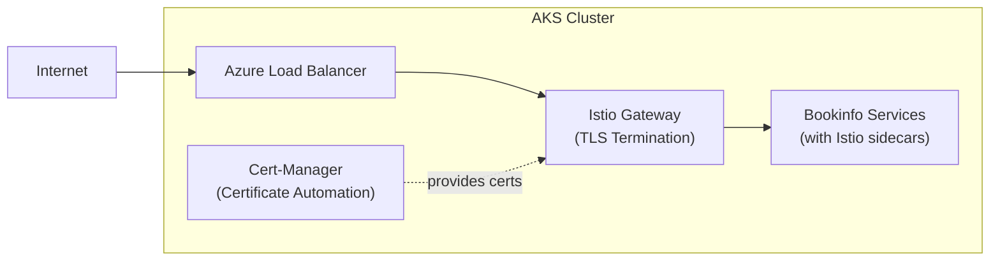

# AKS with Istio, FQDN, and HTTPS: A Complete Guide

This guide demonstrates how to create a secure, modern Kubernetes environment on Azure using industry-standard tools and practices. You'll learn how to set up an AKS cluster with Istio service mesh, configure the Gateway API for traffic management, and implement automatic HTTPS certificate management with Let's Encrypt.

## Quick Start

For those who want to quickly deploy the complete solution:

```bash
curl https://raw.githubusercontent.com/danielscholl/aks-istio-sample/refs/heads/main/install.sh | bash
```

**Requirements:**
- Prerequisites installed (see below)
- Logged into Azure (`az login`)
- Bash shell environment

The script automates all steps in this guide, including resource creation, component installation, and configuration.

## Prerequisites

Before starting, ensure you have:
- [Azure CLI](https://docs.microsoft.com/en-us/cli/azure/install-azure-cli) - For Azure resource management
- [kubectl](https://kubernetes.io/docs/tasks/tools/) - For Kubernetes cluster management
- [istioctl](https://istio.io/latest/docs/setup/getting-started/#download) - For Istio installation and management
- [helm](https://helm.sh/docs/intro/install/) - For package management


## Core Components

This solution integrates several key technologies:

| Component | Purpose | Key Benefits |
|-----------|---------|-------------|
| **[Azure Kubernetes Service (AKS)](https://learn.microsoft.com/en-us/azure/aks/intro-kubernetes)** | Managed Kubernetes platform | Simplified cluster operations with Azure integration |
| **[Istio](https://istio.io/latest/docs/concepts/what-is-istio/)** | Service mesh | Traffic management, security, and observability |
| **[Gateway API](https://gateway-api.sigs.k8s.io/)** | Traffic management | More flexible and powerful than traditional Ingress |
| **[Cert Manager](https://cert-manager.io/docs/)** | Certificate automation | Automatic SSL/TLS certificate management |
| **[Let's Encrypt](https://letsencrypt.org/)** | Certificate authority | Free, automated SSL/TLS certificates |

## Step-by-Step Implementation

### Step 1: Create Azure Resources

First, let's create the necessary Azure resources with a unique identifier to avoid conflicts:

```bash
# Set variables
RESOURCE_GROUP="istio-aks-sample"
LOCATION="eastus"
UNIQUE_ID=$(tr -dc 'a-z0-9' < /dev/urandom | head -c 5)
AKS_NAME="istio-${UNIQUE_ID}-aks"

# Create resource group
az group create --name $RESOURCE_GROUP --location $LOCATION 

# Create AKS cluster with managed identity and Azure CNI
az aks create \
  --resource-group $RESOURCE_GROUP \
  --name $AKS_NAME \
  --node-count 1 \
  --enable-managed-identity \
  --network-plugin azure \
  --network-policy overlay \
  --max-pods 50

# Get credentials
az aks get-credentials \
  --resource-group $RESOURCE_GROUP \
  --name $AKS_NAME \
  --overwrite-existing
```

**Configuration Highlights:**
- **Azure CNI**: Provides enhanced network performance and higher pod density compared to kubenet
- **Managed Identity**: Secures access to Azure resources without storing credentials in the cluster
- **Network Policy**: Enables microsegmentation with the overlay plugin
- **Pod Capacity**: Configured with 50 pods per node for better resource utilization

### Step 2: Install Istio and configure DNS

Next, we'll install Istio service mesh and the Gateway API CRDs:

```bash
# Install Istio
istioctl install --set profile=demo -y

# Install Gateway API CRDs
kubectl apply -f https://github.com/kubernetes-sigs/gateway-api/releases/download/v1.2.1/standard-install.yaml

# Get the Istio ingress gateway IP
INGRESS_IP=$(kubectl get svc istio-ingressgateway -n istio-system -o jsonpath='{.status.loadBalancer.ingress[0].ip}')
echo "Istio ingress gateway IP: $INGRESS_IP"

# Get the node resource group (where the IP is actually created)
NODE_POOL_RESOURCE_GROUP=$(az aks show \
  --resource-group $RESOURCE_GROUP \
  --name $AKS_NAME \
  --query "nodeResourceGroup" -o tsv)

# Find the public IP resource in the node resource group
IP_NAME=$(az network public-ip list \
  --resource-group $NODE_POOL_RESOURCE_GROUP \
  --query "[?ipAddress=='${INGRESS_IP}'].name" -o tsv)

# Set DNS hostname on the IP
az network public-ip update \
  --resource-group $NODE_POOL_RESOURCE_GROUP \
  --name $IP_NAME \
  --dns-name "${UNIQUE_ID}"

# Get the FQDN
FQDN=$(az network public-ip show \
  --resource-group $NODE_POOL_RESOURCE_GROUP \
  --name $IP_NAME \
  --query dnsSettings.fqdn -o tsv)

echo "FQDN: $FQDN"
```

**Gateway API vs Traditional Ingress:**
The Gateway API represents a significant advancement over the traditional Kubernetes Ingress:

| Feature | Gateway API | Traditional Ingress |
|---------|-------------|---------------------|
| Routing Granularity | Fine-grained control | Limited flexibility |
| Implementation Support | Multiple providers | Implementation-specific |
| Protocol Support | Modern protocol features | Basic HTTP/HTTPS |
| Cross-namespace Routing | Explicit with ReferenceGrant | Often implementation-specific |
| Configuration Model | Role-oriented (separation of concerns) | Monolithic |

### Step 3: Install Cert-Manager

Now, let's install cert-manager to automate certificate management:

```bash
# Add Jetstack Helm repository
helm repo add jetstack https://charts.jetstack.io
helm repo update

# Install cert-manager
helm install cert-manager jetstack/cert-manager \
  --namespace cert-manager \
  --create-namespace \
  --version v1.17.0 \
  --set crds.enabled=true
```

**Certificate Management Benefits:**
- **Automated Lifecycle**: Request, validation, issuance, and renewal without manual intervention
- **Provider Integration**: Works with multiple certificate authorities (Let's Encrypt, HashiCorp Vault, etc.)
- **Kubernetes Native**: Uses Custom Resources for certificate configuration
- **Scalability**: Manages certificates across multiple services and ingresses

### Step 4: Configure Let's Encrypt

Let's set up Let's Encrypt for automated certificate issuance:

```bash
# Create the ClusterIssuer for Let's Encrypt staging
kubectl apply -f - << EOF
apiVersion: cert-manager.io/v1
kind: ClusterIssuer
metadata:
  name: letsencrypt-staging
spec:
  acme:
    server: https://acme-staging-v02.api.letsencrypt.org/directory
    email: admin@${FQDN}
    privateKeySecretRef:
      name: letsencrypt-staging
    solvers:
    - http01:
        ingress:
          class: istio
EOF

# Create a Certificate resource:
kubectl apply -f - << EOF
apiVersion: cert-manager.io/v1
kind: Certificate
metadata:
  name: istio-ingressgateway-certs
  namespace: istio-system
spec:
  secretName: istio-ingressgateway-certs
  duration: 2160h # 90 days
  renewBefore: 360h # 15 days
  subject:
    organizations:
      - Example Organization
  commonName: ${FQDN}
  dnsNames:
    - ${FQDN}
  issuerRef:
    name: letsencrypt-staging
    kind: ClusterIssuer
EOF
```

**Benefits of Let's Encrypt:**
- **Zero Cost**: Provides trusted SSL/TLS certificates completely free of charge
- **Automated Renewal**: Certificates automatically renew before expiration (every 90 days)
- **Widely Trusted**: Certificates are recognized by all major browsers and operating systems
- **ACME Protocol**: Standardized protocol for certificate issuance and verification
- **Staging Environment**: Allows testing the integration without hitting production rate limits


### Step 5: Configure the Gateway

Now, we'll set up the Gateway API components to manage traffic:

#### Understanding Gateway API Components

The Gateway API introduces a more structured approach to traffic management:

1. **Gateway**: Defines the infrastructure entry point and listener configuration
2. **HTTPRoute**: Defines how HTTP traffic is routed to backend services
3. **ReferenceGrant**: Securely enables cross-namespace routing

Let's create these resources:

```bash
# Configure the Gateway and HTTPRoute
kubectl apply -f - << EOF
apiVersion: gateway.networking.k8s.io/v1
kind: Gateway
metadata:
  name: istio
  namespace: istio-system
spec:
  gatewayClassName: istio
  addresses:
  - value: istio-ingressgateway 
    type: Hostname
  listeners:
  - name: http
    protocol: HTTP
    port: 80
    allowedRoutes:
      namespaces:
        from: All
  - name: https
    protocol: HTTPS
    port: 443
    hostname: "${FQDN}"
    tls:
      mode: Terminate
      certificateRefs:
      - kind: Secret
        name: istio-ingressgateway-certs
        namespace: istio-system
    allowedRoutes:
      namespaces:
        from: All
---
apiVersion: gateway.networking.k8s.io/v1
kind: HTTPRoute
metadata:
  name: bookinfo
  namespace: istio-system
spec:
  parentRefs:
  - name: istio
    namespace: istio-system
  rules:
  - matches:
    - path:
        type: Exact
        value: /productpage
    - path:
        type: PathPrefix
        value: /static
    - path:
        type: Exact
        value: /login
    - path:
        type: Exact
        value: /logout
    - path:
        type: PathPrefix
        value: /api/v1/products
    backendRefs:
    - name: productpage
      namespace: sample-app
      port: 9080
---
apiVersion: gateway.networking.k8s.io/v1beta1
kind: ReferenceGrant
metadata:
  name: allow-istio-system
  namespace: sample-app
spec:
  from:
  - group: gateway.networking.k8s.io
    kind: HTTPRoute
    namespace: istio-system
  to:
  - group: ""
    kind: Service
    name: productpage
EOF
```

**Key Configuration Features:**
- **Multi-protocol Support**: Handles both HTTP and HTTPS traffic
- **TLS Termination**: Uses our Let's Encrypt certificate for secure communication
- **Path-based Routing**: Routes specific paths to the appropriate backend services
- **Cross-namespace Security**: ReferenceGrant explicitly allows routing across namespaces

**Further Resources:**
- [Gateway API Concepts](https://gateway-api.sigs.k8s.io/concepts/)
- [Istio Gateway Implementation](https://istio.io/latest/docs/tasks/traffic-management/ingress/gateway-api/)
- [Cross-Namespace References](https://gateway-api.sigs.k8s.io/guides/cross-namespace/)

### Step 6: Deploy the Sample Application

We'll deploy the [Istio Bookinfo](https://istio.io/latest/docs/examples/bookinfo/) sample application to demonstrate the configuration:

```bash
# Create namespace and enable Istio injection
kubectl create namespace sample-app
kubectl label namespace sample-app istio-injection=enabled

# Deploy the Bookinfo application from Istio's GitHub repository
kubectl apply -f https://raw.githubusercontent.com/istio/istio/1.24.4/samples/bookinfo/platform/kube/bookinfo.yaml -n sample-app

# Wait for pods to be ready
kubectl wait --for=condition=Ready pods --all -n sample-app --timeout=300s

# Verify the application is running by checking the product page from within the cluster
kubectl exec "$(kubectl get pod -l app=ratings -n sample-app -o jsonpath='{.items[0].metadata.name}')" \
  -c ratings -n sample-app \
  -- curl -sS productpage:9080/productpage | grep -o "<title>.*</title>"
```

**Bookinfo Microservices Architecture:**
The Bookinfo application consists of several microservices:
- **Productpage**: Python service that calls the Details and Reviews services
- **Details**: Ruby service providing book information
- **Reviews**: Java service with three versions (v1, v2, v3) that call the Ratings service
- **Ratings**: Node.js service providing book ratings data

Each service is automatically injected with an Istio sidecar proxy, enabling advanced traffic management, security, and observability features.

### Step 7: Test the Setup

Let's verify that our application is accessible via both HTTP and HTTPS:

```bash
# Test HTTP
curl -s "http://${FQDN}/productpage" | grep -o "<title>.*</title>"

# Test HTTPS
curl -s "https://${FQDN}/productpage" | grep -o "<title>.*</title>"
```

## Solution Architecture

The architecture we've created delivers a modern, secure, and observable platform:



**Key Security Features:**
- TLS encryption for all external traffic
- Automatic certificate rotation
- Service-to-service mutual TLS authentication
- Network policies for microsegmentation
- Identity-based security with managed identities

**Observability Capabilities:**
- End-to-end distributed tracing
- Detailed metrics for all service interactions
- Access logs for traffic analysis
- Service health and status monitoring


## Cleanup

When you're done testing, remove all resources to avoid unnecessary charges:

```bash
az group delete --name $RESOURCE_GROUP --yes
```

This command deletes all resources created during this guide.

---

*This guide provides both automated deployment and step-by-step instructions to help you understand how these technologies work together. For more advanced configurations, refer to the official documentation for each component.*
